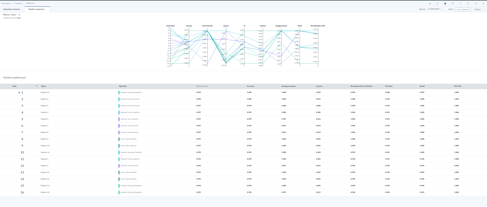
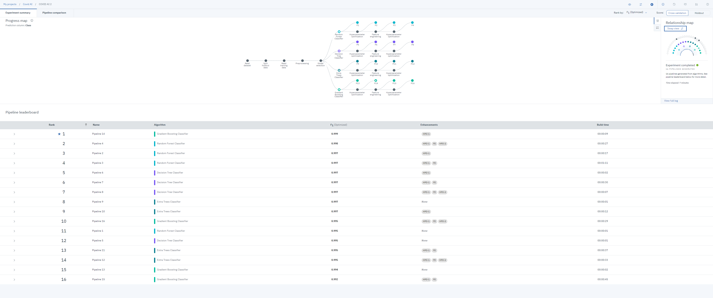

# HackTheGlobe2020

###### COVID-AI is an online tool to anonymously screen concerned patients for the COVID-19. 

###### We utilized IBM's Watson Studio and AutoAI to develop the decision-making model.

Pitch deck: https://docs.google.com/presentation/d/1VcRJgaG5ljINl7mDcFxVLWV7EnMdLpz5L5ypnRh2ytI/edit?usp=sharing
